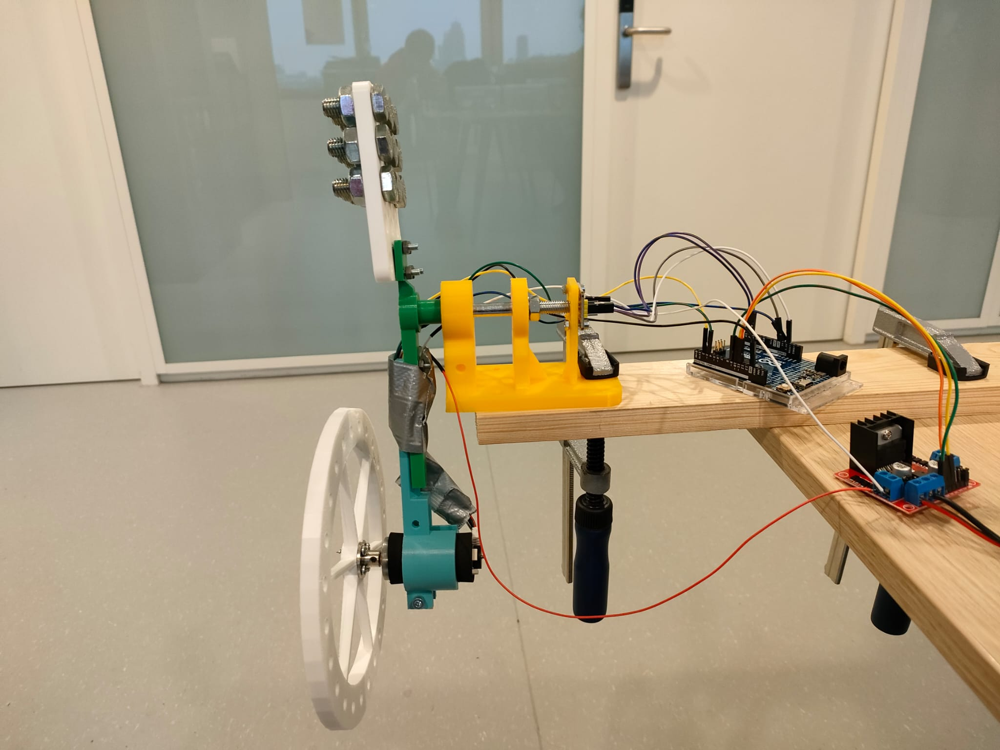

# Brief project description – Team 3
Students from Applied Physics at the HvA in the Netherlands have build and stabilized a rotating inverted wheel pendulum. The team has stabilized the system by using an electric driven motor controlled by an Arduino microcontroller. The code for the system was partly given and some adjustments have been added to complete the goals the team set for themselves. 
---
## Folder explanations
```text
---inverted-pendulum-team-3     
    |   README.md
    |
    +---code
    |   |   README.md
    |   |
    |   +---Arduino
    |   |   +---AS5600_simple
    |   |   |       AS5600_simple.ino
    |   |   |
    |   |   +---Motor_encoder_simple
    |   |   |       Motor_encoder_simple.ino
    |   |   |
    |   |   +---PIDController
    |   |   |       PIDController.ino
    |   |   |
    |   |   +---Swing_pendulum_simple
    |   |   |       Swing_pendulum_simple.ino
    |   |   |
    |   |   \---UpsideDownPendulum
    |   |           UpsideDownPendulum.ino
    |   |
    |   \---Python
    |           csvreader.py
    |           dataOutputResponseCurve.py
    |           LiveData.py
    |
    +---data
    |       DataUpsideDownMeting.csv
    |       data_12-12-2025_13-49.csv
    |       data_12-12-2025_13-51.csv
    |       data_22-11-2025_19-59.csv
    |       data_24-11-2025_10-57.csv
    |       data_24-11-2025_11-02.csv
    |       data_24-11-2025_11-32.csv
    |       data_25-11-2025_12-56.csv
    |       data_25-11-2025_13-08.csv
    |       data_25-11-2025_13-09.csv
    |       README.md
    |
    +---docs
    |       index.md
    |
    +---feedback
    |       feedback-week-2.md
    |       feedback-week-3.md
    |       feedback-week-4.md
    |
    +---progress
    |       weekly-progress.md
    |
    \---visuals
        |   README.md
        |
        +---figures
        |   |   FlowChartV1.jpeg
        |   |   OutputResponseCurve.png
        |   |   README.md
        |   |   setup.jpg
        |   |
        |   \---Flowchart upside down
        |           FlowChartDigital.png
        |           Flowchart_upside_down.jpeg
        |           Support_for_flowchart.jpeg
        |
        \---videos
                README.md
                UpsideDown.mp4
                UpsideDownDemonstratie.mp4
                V1.mp4
```
## 1. Project Motivation
Inverted pendulums are widely used in society and play an important role in our daily lives. They are systems that balance unstable structures using control theory to maintain stability. You can find them in robots, self-balancing vehicles, and even in some engineering applications such as building stabilization systems. Pendulums are an interesting system because they actively stabilize an unnatural and unstable position in real time using feedback and control.


---
## 2. System overview of the mechanical and electrical setup
The mechanical setup is designed by a partner institution from Portugal. They've designed a 3D printed pendulum holder wich fits the elctrical part of our setup perfectly. The flywheel has been through a couple of different versions to filter out some faults in the design. The final product has been designed by the team with the use of Tinkercad and Autodesk Fusion 360 and has completed all the milestones that needed to be reached. The electrical setup contains an JGA25-370 12V DC motor with an encoder of 24V. We've used AS5600 angle sensor wich measures the angle of our motor. ...The data from the sensor is send back into our code... 


---
## 3. Control Principle
Explain in words first (for non-technical people), then more mathematically
(for technical readers).
- The pendulum is naturally unstable in the upright position.
- By accelerating or braking the reaction wheel, we generate torque.
- The controller reads the angle and angular velocity and chooses the motor
command.
(You can show block diagrams as images from `visuals/`.)

---

## 4. Implementation
GitHubPagesTutorial-v4.md 2025-12-09
3 / 9

### 4.1 Arduino Control Software (folder `code/`)
Explain:
- The main entry point is the motor_encoder_simple ([motor_encoder.ino](code/Arduino/Motor_encoder_simple/Motor_encoder_simple.ino)). With this file you can test the motor and with a bit of editing you can find the deadzone of the motor. The deadzone (the zone where the motor wants to spin but doesnt because of lack of power) is important later when you are using a PID controller. The reason for this is because the PID doesnt automatically factor in the deadzone. So if you dont take that into account the PID wont work on tiny adjustments because it just simply wont spin. 
- We havent set the main control loop frequency since we took the pid code straight from the source (https://github.com/br3ttb/Arduino-PID-Library/blob/master/examples/PID_Basic/PID_Basic.ino), theres no loop frequency there so we havent used it. However we have set a frequency on the data. We have set it to 10 Hz. We choose this because of the live data graphs we use. Now it looks fluent because it updates 10 times every second. 
- As mentioned above every 0.1 seconds the data gets updated. This include the sensor readings, output, rpm and frequency. This gets send to a python file to process the data live. However we also measure the angle at the start of every loop. This is needed for the PID controller. The PID updates the motor output to make it spin and then we have set a limit for safety. We have used a constrain function (https://docs.arduino.cc/language-reference/en/functions/math/constrain/) to make sure the output values dont exceed the limit.

- Main control loop frequency (e.g., 100 Hz)
- Which `.ino` file is the main entry point
- How sensor readings and motor outputs are handled

### 4.2 Python Tools (also in `code/`)
Explain:
- When the pendulum is active we run [live_data.py](code/Python/LiveData.py). So we can monitor the output, RPM and angle. It asks how long the measurement will be and will run the time given to it. After the code is finished it will save the data in a csv towards [data](data). And it will also give the final graph. We also created a csv reader that reproduces the final graph of any given file generated by [live_data.py](code/Python/LiveData.py). 

- The outputResponseCurve [OutputResponseCurve](visuals/figures/OutputResponseCurve.png) is generated by [dataOutputResponseCurve](code/Python/dataOutputResponseCurve.py). All the measured frequency's are coded into the file since we didnt have a pyserial connection yet. 

- Reading measurement files from `data/`
- Generating plots saved into `visuals/`
- Any analysis (e.g., identification, performance metrics)
---
## 5. Experiments and Data
Link to measurement files in `data/`:
- [Step response data](../data/step_response.csv)
- [Stabilization log](../data/stabilization_run1.csv)
Include images created from those data:

If you have videos in `visuals/`:
- [Watch the pendulum balancing](../visuals/stabilization_demo.mp4)
Or link to YouTube, if you prefer.
---
## 6. Results
- The pendulum stabilized and came to rest both during the upside down challange and the regular stabilizing challenge. The average time to stabilize the pendulum for the upside down challenge is around 20 seconds. The time for stabilizing the pendulum at an angle of 30 degrees is around the 5 seconds. The system is not that sensitive for distrubances, it balances itself fairly quickly when out of balance.
Some limitations with the design arose during the upside down challenge. The cords attatched to the motor got in the way while the pendulum turned through the     angle barrier, the barrier in wich the pendulum could stabilize itself again if it came to the top. So if the pendulum turned outside of those 30 degrees on one   side, the cords would get tangled and pulled on the motor and Arduino.
Include relevant plots:

---
## 7. Project Timeline (from `/progress`)
See the weekly progress in the link down below.
- [Week 1-5 report](progress/weekly-progress.md)

---
## 8. Team and Credits
Team members:
- Joran Stavenuiter
- Onno Dijkman
- Fleur van Essen
- Rinus Appelman
- Floris de Weerd
- Luka Marcé
---
Team leader:
- Youssef El Bouhassa
--- 
Client:
- Hogeschool van Amsterdam
---
## 9. Repository LINK MAKEN
Project repository:
- [GitHub: inverted-pendulum-international-team-x](https://github.com/Technische-
Natuurkunde-HvA/inverted-pendulum-international-team-x)


