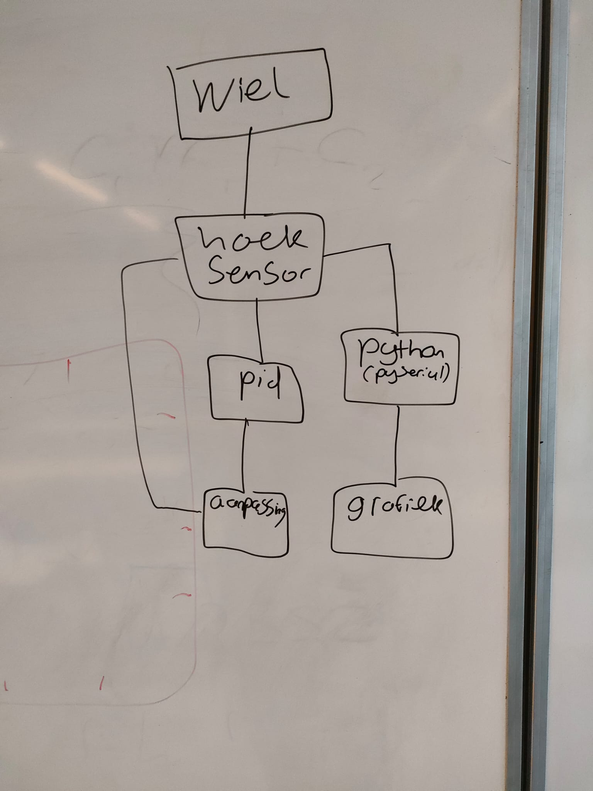

# Brief project description – Team 3
Students from Applied Physics at the HvA in the Netherlands have build and stabilized a rotating inverted wheel pendulum. The team has stabilized the system by using an electric driven motor controlled by an Arduino microcontroller. The code for our system was partly given and we have added our own personal changes for the goals we wanted to reach this project. 
---
## Folder explanations
```text
---inverted-pendulum-team-3     
    |   README.md
    |
    +---code
    |   |   README.md
    |   |
    |   +---Arduino
    |   |   +---AS5600_simple
    |   |   |       AS5600_simple.ino
    |   |   |
    |   |   +---Motor_encoder_simple
    |   |   |       Motor_encoder_simple.ino
    |   |   |
    |   |   +---PIDController
    |   |   |       PIDController.ino
    |   |   |
    |   |   +---Swing_pendulum_simple
    |   |   |       Swing_pendulum_simple.ino
    |   |   |
    |   |   \---UpsideDownPendulum
    |   |           UpsideDownPendulum.ino
    |   |
    |   \---Python
    |           csvreader.py
    |           dataOutputResponseCurve.py
    |           LiveData.py
    |
    +---data
    |       DataUpsideDownMeting.csv
    |       data_12-12-2025_13-49.csv
    |       data_12-12-2025_13-51.csv
    |       data_22-11-2025_19-59.csv
    |       data_24-11-2025_10-57.csv
    |       data_24-11-2025_11-02.csv
    |       data_24-11-2025_11-32.csv
    |       data_25-11-2025_12-56.csv
    |       data_25-11-2025_13-08.csv
    |       data_25-11-2025_13-09.csv
    |       README.md
    |
    +---docs
    |       index.md
    |
    +---feedback
    |       feedback-week-2.md
    |       feedback-week-3.md
    |       feedback-week-4.md
    |
    +---progress
    |       weekly-progress.md
    |
    \---visuals
        |   README.md
        |
        +---figures
        |   |   FlowChartV1.jpeg
        |   |   OutputResponseCurve.png
        |   |   README.md
        |   |   setup.jpg
        |   |
        |   \---Flowchart upside down
        |           FlowChartDigital.png
        |           Flowchart_upside_down.jpeg
        |           Support_for_flowchart.jpeg
        |
        \---videos
                README.md
                UpsideDown.mp4
                UpsideDownDemonstratie.mp4
                V1.mp4
```
## 1. Project Motivation
Inverted pendulums are widely used in society and play an important role in our daily lives. They are systems that balance unstable structures using control theory to maintain stability. You can find them in robots, self-balancing vehicles, and even in some engineering applications such as building stabilization systems. Pendulums are an interesting system because they actively stabilize an unnatural and unstable position in real time using feedback and control.


---
## 2. System overview of the mechanical and electrical setup LINK
The mechanical setup is designed by a partner institution from Portugal. They've designed a 3D printed pendulum holder wich fits the elctrical part of our setup perfectly. The flywheel has been through a couple of different versions to filter out some faults in the design. The final product has been designed by the team with the use of Tinkercad and Autodesk Fusion 360 and has completed all the milestones that needed to be reached. The electrical setup contains an JGA25-370 12V DC motor with an encoder of 24V. We've used AS5600 angle sensor wich measures the angle of our motor. ...The data from the sensor is send back into our code... 


---
## 3. Control Principle
Explain in words first (for non-technical people), then more mathematically
(for technical readers).
- The pendulum is naturally unstable in the upright position.
- By accelerating or braking the reaction wheel, we generate torque.
- The controller reads the angle and angular velocity and chooses the motor
command.
(You can show block diagrams as images from `visuals/`.)

---

## 4. Implementation
GitHubPagesTutorial-v4.md 2025-12-09
3 / 9

### 4.1 Arduino Control Software (folder `code/`)
Explain:
- Main control loop frequency (e.g., 100 Hz)
- Which `.ino` file is the main entry point
- How sensor readings and motor outputs are handled

### 4.2 Python Tools (also in `code/`)
Explain:
- Reading measurement files from `data/`
- Generating plots saved into `visuals/`
- Any analysis (e.g., identification, performance metrics)
---
## 5. Experiments and Data
Link to measurement files in `data/`:
- [Step response data](../data/step_response.csv)
- [Stabilization log](../data/stabilization_run1.csv)
Include images created from those data:

If you have videos in `visuals/`:
- [Watch the pendulum balancing](../visuals/stabilization_demo.mp4)
Or link to YouTube, if you prefer.
---
## 6. Results
- The pendulum stabilized and came to rest both during the upside down challange and the regular stabilizing challenge. The average time to stabilize the pendulum for the upside down challenge is around 20 seconds. The time for stabilizing the pendulum at an angle of 30 degrees is around the 5 seconds. The system is not that sensitive for distrubances, it balances itself fairly quickly when out of balance.
Some limitations with the design arose during the upside down challenge. The cords attatched to the motor got in the way while the pendulum turned through the     angle barrier, the barrier in wich the pendulum could stabilize itself again if it came to the top. So if the pendulum turned outside of those 30 degrees on one   side, the cords would get tangled and pulled on the motor and Arduino.
Include relevant plots:

---
## 7. Project Timeline (from `/progress`)
GitHubPagesTutorial-v4.md 2025-12-09
4 / 9
Explain that the weekly reports in `progress/` document the evolution.
Optionally link to them:
- [Week 1 report](../progress/week01.md)
- [Week 2 report](../progress/week02.md)
- ...
---
## 8. Team and Credits FIX DIT
Team members:
- Joran Stavenuiter
- Onno Dijkman
- Fleur van Essen
- Rinus Appelman
- Floris de Weerd
- Luka Marcé
Team leader:
- Youssef El Bouhassa
Client:
- Hogeschool van Amsterdam
---
## 9. Repository LINK MAKEN
Project repository:
- [GitHub: inverted-pendulum-international-team-x](https://github.com/Technische-
Natuurkunde-HvA/inverted-pendulum-international-team-x)


